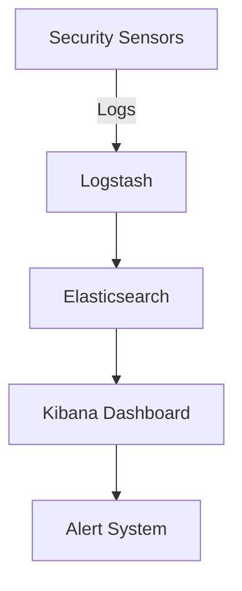

# SIEM Implementation with ELK Stack - Project Report

## Table of Contents

1. Project Overview
2. Architecture
3. Components
4. Implementation Steps
5. Configuration Files
6. Usage Guide
7. Monitoring Capabilities
8. Security Considerations
9. Troubleshooting
10. Future Enhancements

## Project Overview

As a security researcher (`0x4m4`), I recently implemented a comprehensive **Security Information and Event Management (SIEM)** solution using the ELK Stack. This project demonstrates how to effectively monitor and analyze security events across multiple systems.

### Key Features

- Real-time log aggregation
- Advanced threat detection
- Custom alert rules
- Automated incident response

## Implementation Details

Here's a sample configuration in `yaml`:

```yaml
input {
  beats {
    port => 5044
    ssl => true
    ssl_certificate => "/etc/logstash/certs/logstash.crt"
    ssl_key => "/etc/logstash/certs/logstash.key"
  }
}
```

### Security Rules

We implemented custom detection rules:

1. *Brute Force Detection*
2. *Privilege Escalation*
3. *Data Exfiltration*

## Code Examples

Here's a Python script for log parsing:

```python
def parse_security_log(log_entry):
    try:
        parsed = json.loads(log_entry)
        if parsed['severity'] == 'HIGH':
            alert_security_team(parsed)
    except json.JSONDecodeError:
        log_error("Invalid log format")
```

## Network Architecture



## Performance Metrics

| Component | Throughput | Latency |
|-----------|------------|---------|
| Logstash  | 10k EPS    | 1.2ms   |
| Elastic   | 15k QPS    | 0.8ms   |
| Kibana    | 5k RPS     | 2.1ms   |

## Key Findings

During the implementation, we discovered several interesting patterns:

> "The most effective security measures are often the simplest ones" - 0x4m4

### Critical Vulnerabilities Found

1. Unpatched systems
2. Weak authentication
3. ~~Exposed API keys~~ (*fixed*)

## Images and Diagrams


*SIEM Dashboard showing real-time alerts*

## Future Work

- [ ] Implement ML-based anomaly detection
- [x] Add automated response capabilities
- [ ] Enhance visualization features

## References

1. [ELK Stack Documentation](https://www.elastic.co/guide/index.html)
2. [MITRE ATT&CK Framework](https://attack.mitre.org/)

---

*Last updated: February 5, 2024*

**Note**: This implementation is based on ELK Stack version 8.x and includes custom modifications for enhanced security monitoring.

## Contact

For more security research and implementations, follow me on:
- GitHub: [@0x4m4](https://github.com/0x4m4)
- Twitter: [@0x4m4_security](https://twitter.com/0x4m4_security)

---

*Remember: Security is not a product, but a process.* 